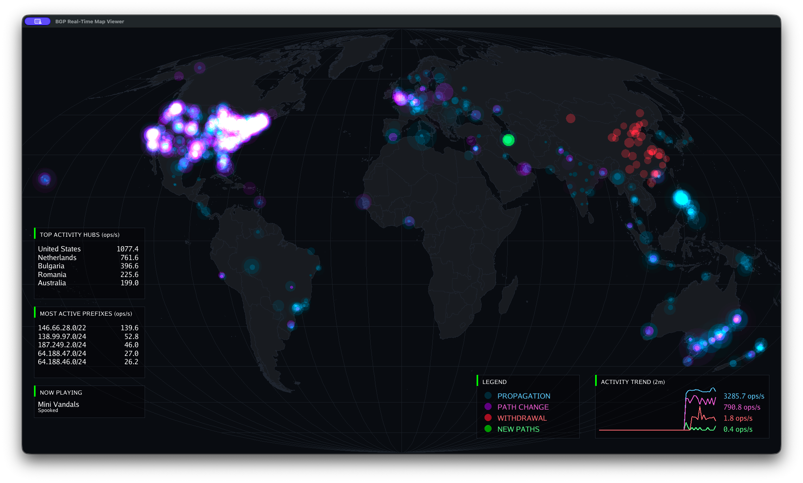

# BGP Stream

A high-performance, real-time BGP (Border Gateway Protocol) visualizer. Watch the heartbeat of the internet's routing layer as it happens.



## Overview

BGP Stream connects to global BGP route collectors and visualizes routing updates as they propagate across the globe. It classifies events into meaningful categories and presents them with a hardware-accelerated map, real-time metrics, and synchronized audio feedback.

## Tech Stack

- **Go (Golang):** The backbone of the project, chosen for its excellent concurrency model and performance.
- **Ebiten (v2):** A hardware-accelerated 2D game engine used for rendering the global map, pulses, and real-time UI.
- **WebSocket:** Used to stream live BGP messages from the RIPE RIS Live service.
- **BadgerDB / DiskTrie:** Provides high-performance persistent storage to track "seen" prefixes across sessions.
- **Audio:** A built-in background music player that loops MP3s from the `audio/` directory, with support for local playback or streaming via a pipe.

## Data Sources

The project aggregates data from several authoritative sources:
- **RIPE RIS Live:** The primary source for real-time BGP UPDATE messages from hundreds of peer routers globally.
- **RIR Delegated Lists:** Statistics from APNIC, RIPE NCC, AFRINIC, LACNIC, and ARIN are used to map IP blocks to countries.
- **Cloud IP Ranges:** Real-time fetching of Google Cloud (Geofeed) and AWS (JSON) IP ranges for high-precision identification of cloud-hosted infrastructure.
- **World Cities Database:** Provides geographic coordinates for city-level activity hubs.

## Event Classification Methodology

BGP updates are processed through a multi-stage classification engine:

- **NEW PATHS:** A prefix that has never been seen before across any session (verified against a persistent `seen-prefixes.db`).
- **PATH CHANGE:** An announcement for a known prefix, or an announcement that arrives within 10 seconds of a withdrawal for the same prefix.
- **WITHDRAWAL:** A BGP withdrawal message indicating a prefix is no longer reachable via a specific path.
- **PROPAGATION (Gossip):** Redundant updates or announcements seen for the same prefix within a 15-second deduplication window.
- **Beacon Filtering:** Known [RIPE Routing Beacons](https://ris.ripe.net/docs/routing-beacons/) are automatically excluded from "Most Active" metrics to ensure legitimate network volatility is highlighted.

## Real-time Processing

To ensure a smooth and meaningful visualization, the engine employs several techniques:
- **Deduplication (15s):** Filters high-frequency redundant updates that would otherwise clutter the view.
- **Withdraw Resolution (10s):** Wait window to distinguish between a simple withdrawal and a rapid path re-convergence (Path Change).
- **Paced Emission:** BGP spikes are buffered and emitted into the visualization every 500ms, preventing the UI from becoming unreadable during massive routing events.
- **Logarithmic Scaling:** Metrics and pulse sizes use logarithmic scaling to handle the massive dynamic range of BGP activity (from 1 to 100,000+ ops/s).

## Running Locally

### Prerequisites
- [Go 1.24+](https://golang.org/dl/)
- [just](https://github.com/casey/just) (optional, but recommended)
- [CGO Dependencies:](https://ebitengine.org/en/documents/install.html) Required for Ebiten (standard dev headers for ALSA/X11 on Linux, none on macOS/Windows).

### Development
```bash
# Run the project directly
just run

# Run tests
just test
```

## Environment Variables

- `YOUTUBE_STREAM_KEY`: (Optional) Used by the Docker entrypoint for headless streaming.

## License

This project is licensed under the MIT License - see the [LICENSE](LICENSE) file for details.
